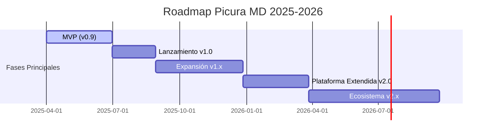

# Roadmap de Producto Picura MD

## Visión General

Este roadmap presenta la estrategia de desarrollo planificada para Picura MD, detallando las fases principales desde el MVP hasta versiones futuras. Nuestro enfoque prioriza un desarrollo incremental con ciclos de retroalimentación frecuentes, manteniendo nuestro compromiso con la sostenibilidad, experiencia empática, seguridad por diseño y adaptabilidad.

## Cronograma de Alto Nivel

## Fase 1: MVP (v0.9) - Q2 2025

Enfoque en establecer la base sólida con funcionalidades esenciales y principios fundamentales.

### Objetivos Principales:
- Validar propuesta de valor con usuarios reales
- Establecer infraestructura sostenible desde el inicio
- Demostrar viabilidad técnica de funcionalidades clave

### Entregables:

#### Q2 2025
- **Editor Markdown Adaptativo**
  - Tres modos de interfaz (Básico, Estándar, Avanzado)
  - Soporte completo para GFM (GitHub Flavored Markdown)
  - Vista previa en tiempo real optimizada
  
- **Gestión Documental Básica**
  - Organización jerárquica con carpetas y etiquetas
  - Sistema de búsqueda local optimizado
  - Historial de versiones local
  
- **Sincronización Git Fundamental**
  - Integración con repositorios Git locales
  - Sincronización básica con GitHub (repositorios públicos)
  - Resolución simple de conflictos
  
- **Monitor de Sostenibilidad v1**
  - Métricas fundamentales de consumo de recursos
  - Recomendaciones básicas de optimización
  - Panel de impacto ambiental

- **Asistente IA Local v1**
  - Corrección ortográfica y gramatical local
  - Sugerencias básicas de estilo
  - Procesamiento prioritariamente local

## Fase 2: Lanzamiento (v1.0) - Q3 2025

Refinamiento del MVP basado en feedback de usuarios y mejoras de estabilidad.

### Objetivos Principales:
- Lanzamiento oficial con alta estabilidad y rendimiento
- Incorporación de mejoras basadas en retroalimentación del MVP
- Establecimiento de canales de distribución principales

### Entregables:

#### Q3 2025
- **Experiencia Pulida**
  - Refinamiento UI/UX basado en feedback
  - Optimizaciones de rendimiento globales
  - Mejoras de accesibilidad (WCAG 2.1 AA completo)
  
- **Sincronización Mejorada**
  - Soporte para repositorios privados
  - Optimización avanzada de transferencia
  - Mejor resolución de conflictos
  
- **Plantillas y Snippets**
  - Biblioteca inicial de plantillas por vertical
  - Sistema de snippets reutilizables
  - Importación/exportación de plantillas
  
- **Instaladores Oficiales**
  - Distribución en tiendas de aplicaciones principales
  - Actualizaciones automáticas seguras
  - Instalación optimizada para diferentes sistemas

## Fase 3: Expansión (v1.x) - Q4 2025 - Q1 2026

Ampliación de funcionalidades y primer paso hacia verticales específicas.

### Objetivos Principales:
- Expandir funcionalidades para cubrir más casos de uso
- Introducir módulos verticales especializados
- Mejorar capacidades colaborativas

### Entregables:

#### Q4 2025 (v1.1-1.2)
- **Módulos Verticales Iniciales**
  - Picura Technical (v1)
  - Picura Business (v1)
  - Plantillas y flujos de trabajo especializados
  
- **Colaboración Mejorada**
  - Comentarios y anotaciones
  - Flujos de trabajo de revisión
  - Seguimiento de cambios avanzado
  
- **Extensiones Básicas**
  - Sistema de plugins simple
  - APIs documentadas para extensiones
  - Marketplace inicial de extensiones

#### Q1 2026 (v1.3-1.4)
- **Módulos Verticales Adicionales**
  - Picura Academic
  - Picura Creative
  - Integraciones específicas por vertical
  
- **Asistente IA Avanzado**
  - Generación contextual de contenido
  - Análisis semántico de documentación
  - Modelos adaptados a verticales
  
- **Analítica y Métricas**
  - Insights sobre uso documental
  - Métricas de calidad y consistencia
  - Panel de tendencias y patrones

## Fase 4: Plataforma Extendida (v2.0) - Q2 2026

Evolución hacia un ecosistema completo con servicios cloud opcionales.

### Objetivos Principales:
- Lanzar plataforma cloud complementaria
- Mejorar capacidades empresariales
- Expandir integraciones con servicios externos

### Entregables:

#### Q2 2026
- **Picura Cloud**
  - Sincronización bidireccional avanzada
  - Colaboración en tiempo real
  - Permisos y roles avanzados
  
- **Características Empresariales**
  - SSO y gestión centralizada
  - Auditoría y cumplimiento
  - Despliegue gestionado on-premise
  
- **Ecosistema de Integraciones**
  - Conectores para herramientas populares
  - API pública documentada
  - Webhooks y automatizaciones

## Fase 5: Ecosistema (v2.x) - Q3-Q4 2026

Consolidación como plataforma integral de conocimiento con IA avanzada.

### Objetivos Principales:
- Establecer Picura como plataforma de conocimiento organizacional
- Implementar IA avanzada con aprendizaje organizacional
- Ampliar capacidades de visualización y presentación

### Entregables:

#### Q3 2026 (v2.1-2.2)
- **Gestión de Conocimiento**
  - Grafos de conocimiento automatizados
  - Recomendaciones contextuales inteligentes
  - Vinculación semántica entre documentos
  
- **IA Organizacional**
  - Aprendizaje de patrones por organización
  - Asistencia predictiva avanzada
  - Generación especializada por dominio

#### Q4 2026 (v2.3-2.4)
- **Visualización Avanzada**
  - Modo presentación profesional
  - Gráficos y diagramas interactivos
  - Dashboards de documentación
  
- **Plataforma de Transformación Documental**
  - Flujos automatizados de documentación
  - Traducción y localización integradas
  - Accesibilidad universal (WCAG 2.1 AAA)

## Compromiso de Sostenibilidad Continua

A lo largo de todas las fases, mantendremos nuestro compromiso con:

- **Optimización Continua**: Mejora progresiva de eficiencia energética y recursos.
- **Transparencia**: Publicación regular de métricas de impacto ambiental.
- **Accesibilidad**: Mejora constante de inclusividad y adaptabilidad.
- **Seguridad**: Actualización proactiva de prácticas de seguridad y privacidad.

## Proceso de Priorización

Este roadmap se revisará trimestralmente y se ajustará según:

1. Retroalimentación de usuarios y métricas de adopción
2. Avances tecnológicos relevantes
3. Impacto ambiental y potencial de mejora
4. Oportunidades de mercado emergentes
5. Recursos disponibles y capacidades del equipo

Las actualizaciones al roadmap se comunicarán transparentemente a través de nuestros canales oficiales y documentación.

---

*Nota: Este roadmap representa nuestras intenciones actuales de desarrollo y está sujeto a cambios según evolucionen las necesidades de los usuarios, las condiciones del mercado y los avances tecnológicos.*

*Última actualización: Marzo 2025*